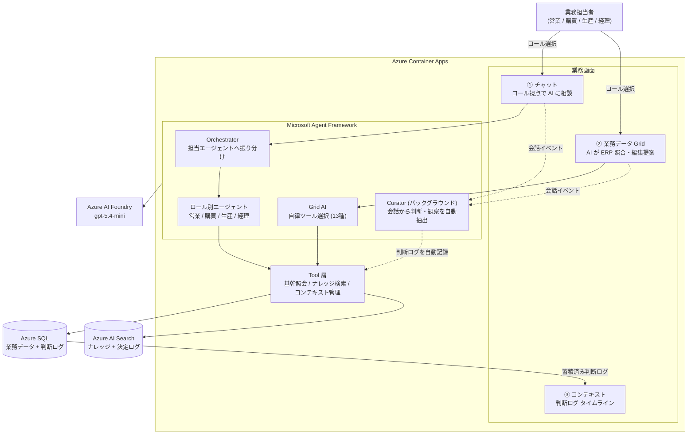
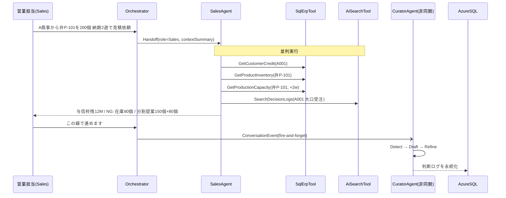
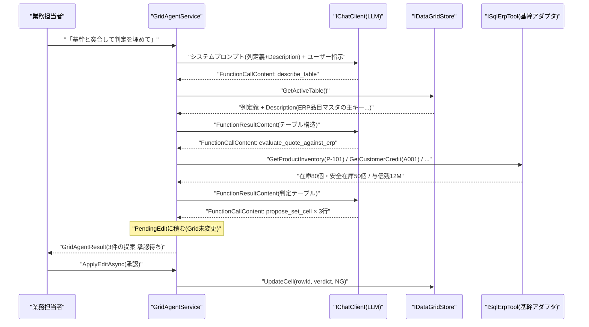
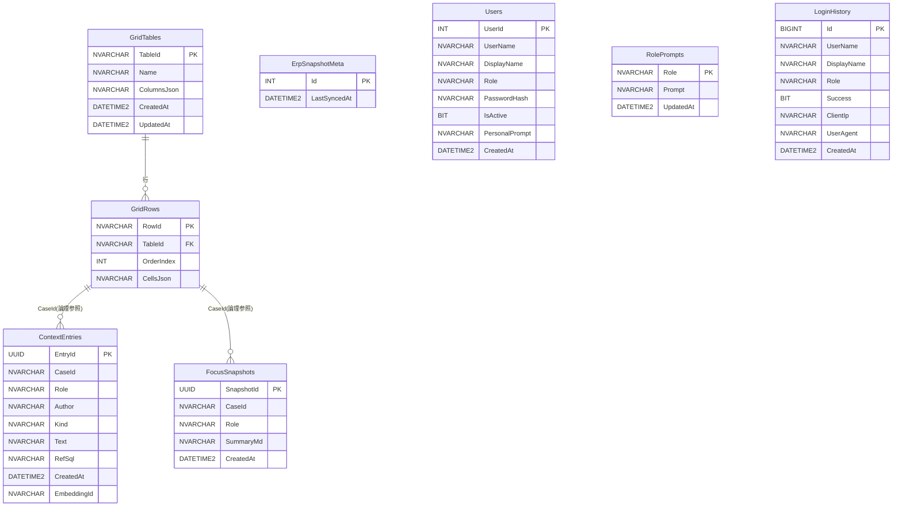

:::message
本記事は [Microsoft Agent Hackathon 2026 powered by Tokyo Electron Device](https://zenn.dev/hackathons/microsoft-agent-hackathon-2026) への提出作品として書いています。
:::

## ERPが記録しないもの

ERPには取引先の与信情報、在庫数、生産能力、過去の受注実績がすべて揃っています。データが足りないわけではありません。

問題は、担当者が下した「判断」が一切記録されないことです。ERPからデータを引き出して、Excelの上に判断を書き込んで、メールで回す。「この件は分割出荷で進める」「与信枠が怪しいので要確認」——そういう判断は、Excelのメモ欄か誰かの記憶の中にしか存在しません。3日後に別の担当者が同じ案件を触ったとき、その判断はもうどこにもありません。毎週同じ問い合わせが来るのは、前回の判断理由が引き継がれないからです。

ERPは事実（何が起きたか）を記録するために精緻に作られています。でも判断（なぜそうしたか）を記録する仕組みは、どこにもありませんでした。

その結果として起きることを具体的に書くと、A商事から大口受注が入った場面でこうなります。

- 営業は「与信枠に余裕があるか、今週中に納品できるか、粗利は確保できるか」を見て判断する
- 経理は「3か月前に支払い遅延があった、与信枠の80%がすでに消費されている、売上計上が月をまたぐ」を見て別の判断をする
- 生産は「2週間で120個まで対応可能だが、残り80個は翌週にずれ込む」を見てさらに別の判断をする

同じデータから、担当者ごとにまったく別の判断が生まれます。でもその判断はそれぞれ別のExcelの上に閉じ込められ、共有も蓄積もされません。「営業的にはOKだが経理的に懸念がある」という判断が、次の担当者に届かないまま揮発していきます。

### なぜ「AIに聞く」では解けないのか

「ERP画面の横にチャットを置けばいい」と思うかもしれません。でもそれは「AIに聞く」であって「AIと一緒に仕事をする」ではありません。

AIに質問して答えをもらっても、担当者は結局Excelを自分で直します。判断はまたExcelの中に閉じ込められ、根本の構造は変わりません。判断の揮発は「AIに聞く」では止まりません。AIへの質問は記録されても、その結果として下された判断は依然としてどこにも残らないからです。

問題は3つの裂け目として構造化できます。

1つ目は、判断がロール間で翻訳されない問題です。「経理から見た答え」は自然には出てきません。同じ案件データを経理視点で読み解いてくれる存在がなければ、担当者は自分のロールの範囲でしか判断できません。

2つ目は、判断が時間を超えて引き継がれない問題です。「今回は分割提案で進める」という合意がどこかにメモされなければ、3日後に別の担当者が同じ質問をします。このループは、判断を記録する仕組みがない限り何度でも繰り返されます。

3つ目は、判断がデータに還流しない問題です。AIと会話しながら、ERP突合・セル補完・判定記入・コンテキスト記録を一気通貫でやれる環境はこれまで存在しませんでした。担当者がAIに聞いて得た判断は、結局Excelのメモに手書きされるか、記録されないまま終わります。

この3つの裂け目を同時に埋めるために、マルチエージェント構成 + Grid × AI 協働編集という構成にしました。


https://github.com/sti-ytmori/OpsContext

## デモ動画

https://youtu.be/PpdYmjhab54

## 作ったもの: OpsContext

OpsContextの対象ユーザーは、ERPを日常的に使う製造業・商社の業務担当者（営業・購買・生産・経理）です。担当者ごとに視点が異なる中で、判断の記録と引き継ぎが構造的に欠落しているという課題を解決します。

OpsContextは、ERPが記録しない「判断」を、業務データの隣にリアルタイムで蓄積するプラットフォームです。AIエージェントと人間が同じGridの上で協働し、その過程で下された判断はコンテキストとして自動的に積み上がります。次の担当者が同じ業務データを開いたとき、前任者の判断理由がそのロール視点に翻訳されて表示されます。

4本の機能軸を持っています。

1. **新規チャット** (`/chat`) — [翻訳] ロール別エージェントとの対話。営業・購買・生産・経理でシステムプロンプトが切り替わり、同じ質問でも語り口とフォーカスが変わります。
2. **業務データ** (`/data`) — [還流] テーブル一覧画面。新規テーブル作成やテーブル選択ができます。テーブルを開くと `/data/{TableId}` に遷移し、Grid編集とAI協働チャットが使えます。列に「意味（Description）」を登録することで、AIがその列に対応する基幹照会を自律選択します。
3. **データセット** (`/dataset`) — 基幹ERPデータの読み取り専用ビュー。顧客・製品・在庫・生産能力・受注のマスタ・トランザクションをタブで閲覧できます。AIが参照する突合元データをそのまま確認できます。
4. **コンテキスト管理** (`/context`) — [継承] 業務データごとに蓄積された決定・観察ログのタイムライン。コンテキストの記録単位は業務データ（GridテーブルのTableId）であり、同じ業務データを開いた担当者やロールが判断ログを共有できます。判断ログ収集エージェント (Curator) が自動生成した全ロール共有エントリは横断参照できます。

データセット画面では、AIが突合に使う基幹マスタ（顧客の与信枠・残枠・格付けなど）をそのまま参照できます。


## システムアーキテクチャ図




| レイヤー | 技術 |
|---|---|
| Web フレームワーク | ASP.NET Core Blazor Server (.NET 10) |
| エージェント基盤 | Microsoft Agent Framework (Microsoft.Agents.AI v1.8.0) |
| LLM | Azure AI Foundry gpt-5.4-mini |
| Embedding | text-embedding-3-small |
| ベクトル検索 | Azure AI Search (ナレッジ / コンテキスト 2インデックス) |
| RDB | Azure SQL Database (Serverless, 無料オファー) |
| コンテナ実行基盤 | Azure Container Apps |
| デモ動画ナレーション | Azure AI Speech |

## エージェント設計

3つの裂け目（翻訳・継承・還流）を埋めるために、エージェントは6本 + GridAgentServiceで構成しました。

| エージェント | 役割 |
|---|---|
| Orchestrator | ロール claim を見てロール別エージェントへ委譲 |
| SalesAgent | 与信・在庫・生産能力を並列照会し、営業視点で受注可否・分割提案を判断 |
| AccountingAgent | 与信状況と過去判断ログを照会し、経理視点で回収リスク・与信超過を評価 |
| PurchasingAgent | 在庫・類似受注・購買ナレッジを照会し、調達リスクと代替品を評価 |
| ProductionAgent | 生産能力・在庫・生産ナレッジを照会し、納期実現可否とリスクを評価 |
| CuratorAgent | 会話から判断を自動抽出して蓄積（非同期） |
| GridAgentService | 業務データ Grid への自律AI協働編集・基幹多段照会・承認ゲート |

### ロール委譲: Orchestratorはルーティングだけしてロールエージェントに渡す



Orchestratorはコンテキスト取得だけ自分でやって、要約を添えてロールエージェントに会話を委譲します。複雑な判断はしません。ロール claim で宛先を決めるルーターです。

### GridAgentService: LLMが自律ツール選択で基幹を多段照会する

LLMが13種のツールを自律選択して多段実行します。ERP照会やナレッジ検索などの読み取りは自動実行し、セル更新・行追加などの書き込みは提案として積んで人間の承認を待ちます（Human-in-the-loop）。

鍵になるのが「列の Description（意味）がAIのツール選択判断の根拠になる」点です。たとえば品番列に「ERP品目マスタの主キー」と書いておくと、AIが在庫照会・生産能力照会を自律選択します。物理的なデータ統合ではなく、列の説明を介した動的なツール選択です。



AIが提案を積むとUI右パネルに「N件の編集提案があります」と表示され、担当者が1件ずつ（または一括で）承認・却下します。承認されてはじめてGridに反映されます。


数値判断は `QuoteValidationService`（`evaluate_quote_against_erp` の内部処理）が決定的に計算し、LLMは推奨文の生成のみを担います。「数値判断はコード、文章はLLM」の方針はGridAgentServiceでも継承しています。

### 判断ログ自動収集 (Curator): 会話を裏で監視して判断を蓄積する

チャットや Grid 操作の中で「この線で進めます」「承認します」といった判断は、会話の流れに埋もれてしまいます。ロール別エージェントは照会と回答に専念しており、判断を拾って記録することは担当外です。CuratorAgent はそこを補う専任の記録係です。

CuratorAgentはBackgroundServiceとして常駐し、Channelで受け取った会話イベントを非同期で処理します。ユーザーが「この線で進めます」と入力した瞬間、fire-and-forgetでCuratorにイベントを投げます。Blazorの応答速度に影響せず、裏で勝手に記録が積み上がっていきます。

Grid上の操作も同じ仕組みでコンテキストに記録されます。ERP突合を実行すると「Excel明細 N 行取込・うち M 行リスク」という observation が自動的にContextEntriesに追記され、同じ業務データをチャット画面で開いた担当者に引き継がれます。コンテキストの保存単位は業務データ（TableId）なので、「発注明細」と「在庫一覧」はそれぞれ独立した判断ログを持ちます。

3ターンに1回、全エントリからロール別のFocusSnapshotも生成されます。次の担当者がロールを切り替えて同じ業務データを開くと、「現在フォーカス / 懸案事項 / 次のアクション」がそのロール視点で再構成されて表示されます。

## プロンプト設計

プロンプトはエージェントごとに完全に分けています。

### SalesAgentのシステムプロンプト

```
あなたは営業担当エージェントです。受注獲得・粗利確保・顧客との長期関係維持を最優先に分析してください。

## 役割と責務
- 与信枠の状況を踏まえた受注可否の判断
- 在庫・生産能力と納期の整合性チェック
- 分割受注・代替提案などの受注獲得シナリオの提示
- 過去類似案件を参照した判断根拠の明示

## 回答方針
- 数値は必ず明示する（曖昧にしない）
- リスクがある場合は「NG / Warning / OK」で判定してから説明する
- 推奨アクションを最後に箇条書きで示す

## 案件コンテキスト
{contextSummary}
```

「NG / Warning / OKで判定してから説明する」という出力形式を強制しているのがポイントです。LLMを自由にさせると「与信に若干の懸念があります」のような曖昧な表現を返しがちです。判定カテゴリを先に置くことで、一目でリスクが把握できる画面になりました。

AccountingAgentはまったく別のシステムプロンプトを持ち、与信回収・遅延歴・売上計上の観点を前に押し出します。同じ基幹データを渡しても、どのロールが受け取るかで回答の切り口が変わる——それがOpsContextの根幹にある考え方です。

### GridAgentServiceのシステムプロンプト

GridAgentServiceはシステムプロンプトに現在のテーブルの列定義（`Description` 含む）を埋め込み、LLMに行動規範を与えます。LLMはアクションJSONを1回返すのではなく、ツールを自律選択して段階的に課題を解決するよう指示されます。

```
# GRID_AGENT_MODE
あなたは業務データ Grid を扱う自律エージェントです。ツールを自分で選んで段階的に課題を解決します。

## 行動規範
- まず describe_table と read_rows でデータ構造・各列の意味・中身を理解してから動くこと。
- 列の意味(説明)を踏まえ、どの基幹照会(get_customer_credit / get_product_inventory /
  get_production_capacity / search_similar_orders / evaluate_quote_against_erp)が
  必要かを自分で判断して呼ぶこと。
- 数値判断は evaluate_quote_against_erp に任せ、その結果を根拠にすること。
- データ変更は必ず propose_* ツールで提案すること。あなたは Grid を直接変更できない。承認は人間が行う。
- 「更新しました」と断定せず、「〜を提案しました（承認待ち）」と述べること。
- 最終回答は日本語で、何を読み・何を根拠に・何を提案したかを簡潔にまとめること。

## 現在のテーブル「見積明細」の列
- key=product_code 表示名=品番 型=Text 意味=ERP品目マスタの主キー。英大文字+ハイフン+3桁数字の形式（例: P-101）。
- key=qty 表示名=数量 型=Number 意味=発注・見積の数量（通常は「個」）。
- key=unit_price 表示名=単価（円） 型=Number 意味=税抜き単価。ERP価格マスタの直近単価と突合する。
- key=verdict 表示名=判定 型=Text 意味=AIによるERP突合結果。OK / Warning / NG の3値。
...（実行時に全列を動的埋め込み）
```

`GRID_AGENT_MODE` マーカーをシステムプロンプトに埋め込み、Azure 接続なしで動作するモックモード（MockChatClient）ではこのマーカーを検出してデモ用のツールループ応答を返します。本番（Azure OpenAI）でも同一コードパスで動きます。

`describe_table` が Description を返すことでLLMが列の意味を理解し、どの基幹照会が必要かを自律判断します。固定のアクション分類ではなく、列の説明から動的にツールを選ぶ仕組みです。

### Curatorが判断を抽出する3ステップ: 検出 → 下書き → 圧縮

Curator は会話テキストをそのまま保存するのではなく、3回 LLM を呼び出して「判断として記録すべき内容」だけを絞り込みます。1回目（検出）で判断の有無を JSON で確認し、2回目（下書き）で構造化 Markdown を生成し、3回目（圧縮）で 400 字以内に要約します。

検出プロンプトで一番こだわった部分です。

```
直近の会話ターンから暗黙の意思決定・判断・合意を検出してください。

検出ルール:
- "〜することにした" "〜で進める" "〜は却下" 等の表現を含む発言を対象とする。
- ユーザーが「この線で進めます」「承認します」「了解しました」と明示した場合は必ず検出する。

非検出:
- 単なる情報確認・質問・数値の整形のみのターンは検出しない。

出力形式: JSON 配列のみを出力すること。
[{"summary":"決定内容の要約","evidence":"根拠となった発言","status":"confirmed|tentative"}]
検出なしの場合は [] のみ出力する。
```

出力をJSON配列に強制しているのは、後続のDraftプロンプトでパースできるようにするためです。`[]` が返ってきたら判断なしと判定して処理を打ち切ります。ここで止まらないと、雑談まで記録され始めます。

DraftプロンプトはDecision / Context / Chosen / Why / Riskの5セクションを持つMarkdownテンプレートを出力形式として指定しています。Refineは単純な圧縮指示で、見出し構造だけ維持して400字以内に収めます。

### FocusSnapshotのロール別要約プロンプト

FocusSnapshot とは、蓄積された判断ログ全体をロール視点で要約したサマリーです。Curator が3ターン処理するごとに生成し、次の担当者がチャット画面を開いたときに「現在フォーカス / 懸案事項 / 次のアクション」としてロール別に表示します。

前述の通り3ターンに1回、全コンテキストエントリから各ロール視点の「現在フォーカス」を生成します。

```
あなたは案件コンテキストの要約担当です。
ユーザーが送信するエントリ一覧からロール {role} 視点の現在フォーカスを Markdown で出力してください。

出力ルール:
- 全文のみ出力。コードフェンス禁止。切り詰め禁止。
- 見出し構造（## 現在フォーカス / ## 懸案事項 / ## 次のアクション）を維持する。
- {role} ロールに関係する判断・引継ぎを優先してまとめる。
```

コードフェンス禁止・切り詰め禁止を明示しているのは、LLMが勝手に `...` で省略してFocusSnapshotが壊れるのを防ぐためです。実際にハマって追加した制約です。

## ビジネスインパクト

ERPが記録しない「判断」を業務データの隣に蓄積するとは、具体的にどういうことか。3つの裂け目をそれぞれ埋めます。

### 判断がロール間で翻訳されない → 部門翻訳コストの解消

ERPデータへのアクセス権があっても、「自分のロール視点で読み解く能力」は担当者に依存します。OpsContextはロール別エージェントがこの翻訳を自動化し、新担当者が案件を引き継いでも「経理視点の懸念点」が即座に参照できます。

### 判断が時間を超えて引き継がれない → コンテキストの継承

CuratorAgent が直前の会話全体を解析して「A商事案件: 分割出荷150個+80個で合意、与信枠確認済み」という判断ログを生成します。3日後に別の担当者がロールを切り替えて同じ業務データを開くと、その判断がロール視点に翻訳されて表示されます。毎週同じ問い合わせが来るループが、初めて断てます。

### 判断がデータに還流しない → Excel引き回し文化への回答

見積書データGrid表示 → AIに「基幹と突合して」と指示 → GridAgentServiceが品番列からERP在庫・与信・生産枠を自律照会し、判定/リスク/推奨アクションをセルへの提案として積む → 担当者が承認するとGridに反映されます。この結果をコンテキストに記録すると、同じ業務データを次に開いた担当者には「Excel明細 N 行取込・うち M 行リスク」という観察ログが引き継がれています。コンテキストは業務データ単位で蓄積されるため、「発注明細の突合結果」は「在庫一覧の判断」と混ざりません。ExcelとERPとコンテキストが初めてつながります。

### 実ERPへの接続を見据えて

導入コストの観点では、SQLスキーマをERPの実テーブルにマッピングする作業と、接続情報のDI差し替えが主な追加作業になります。エージェントのシステムプロンプトと判断ロジック（CalcTool）はERP固有の業務知識を盛り込んでいるため、そのまま流用できる部分が多いです。

## 技術詳細

### データモデル



物理テーブルは `GridTables` / `GridRows` の2本に統一しています。ERP基幹データ（顧客・製品・在庫・生産能力・受注・与信履歴）は `TableId` が `erp_` で始まる論理テーブルとして `GridRows` に格納され、セル値は `CellsJson`（`Dictionary<string,string?>` のJSON）として保持します。実際のERP連携では API/ODBC 経由の定期同期でこの `erp_` 行群を上書きする設計で、`ErpSnapshotMeta` が最終同期日時を記録します。業務データ（担当者が作成する見積明細等）は `erp_` 以外の `TableId` を持つ行として同じ `GridRows` に共存します。`ContextEntries` と `FocusSnapshots` の `CaseId` は `GridRows.RowId` を文字列参照する論理結合で、FK制約は持ちません。`Users` と `RolePrompts` はアプリ管理テーブルとして独立しています。


### GridAgentServiceを「自律ツール選択型」にした理由

当初の GridChatService は「LLM 1回呼び出し → 固定アクション JSON」方式でした。この方法だと数値判断（在庫が足りるか、与信を超えるか）もLLMに委ねることになり、ハルシネーションリスクが高くなります。また、どの基幹照会が必要かの判断を呼び出し側が事前に決めなければならず、汎用性が低いという問題もありました。

GridAgentServiceで徹底した分離は2点あります。「LLMはツールの選択と推奨文の生成だけを行い、与信残額の計算・ERP突合判定（OK/Warning/NG）などの数値判断はコードで決定的に行う」こと。そして「書き込みはGridに直接反映せず提案として積み、人間が承認したときのみ適用する（Human-in-the-loop）」にすることです。

これにより、列の Description を読んだLLMが「この品番列はERP品目マスタのキーだ → `get_product_inventory` を呼ぼう」と自律判断する流れが成立します。固定スクリプトではなく、テーブル定義が変わっても Description さえ書いておけばエージェントが適切な基幹照会を選びます。

### 擬似ERP環境の作り込みレベルの判断

SQLスキーマはERPの実テーブル構造をそのまま持ち込んでいません。取引先マスタ・製品マスタ・在庫・生産能力・売掛残高・与信限度・支払い遅延歴の7テーブルをデモシナリオに必要な最小限で設計しています。

「A商事の3か月前の支払い遅延」という一行が経理エージェントの回答を変えるのは、AccountingAgentのシステムプロンプトが「与信状況と過去判断ログを照会し、経理視点で回収リスク・与信超過を評価する」と定義されており、その照会先に支払い遅延歴テーブルが含まれているからです。

:::message
擬似ERP環境での動作であり、実際のERPパッケージとの接続は含んでいません。本番ERP連携にはスキーママッピング作業が別途必要になります。
:::

## 今後の展望

実業務への適用を考えると次のステップが想定されます。

- 実ERPテーブル構造へのスキーママッピングのカスタマイズ性向上
- MCPサーバ化による実基幹接続（ISqlErpToolをMCPサーバ経由のアダプタに差し替え）
- Entra ID App Roles によるエンタープライズレベルの認証
- Grid定義のリレーションのユーザーカスタマイズ（複数テーブル管理）

## おわりに

ERPは「事実のシステム・オブ・レコード」として長年機能してきました。何が起きたかは全部記録されます。でも「なぜそう判断したか」のシステム・オブ・レコードはありませんでした。OpsContextはそこを埋めようとする試みです。

デモ用の初期データに仕込んだ「A商事の3か月前の支払い遅延」という一行が経理エージェントの回答を変える——このリアリティは、ERP業務の知識と設計経験から直接生まれています。テーブル構造、プロンプトの業務ロジック、デモシナリオの解像度はすべてそこから来ています。Microsoft Agent FrameworkとAzureのスタックを活用することで、Microsoftテクノロジーの使い倒し評価軸にも応えるよう設計しました。

リポジトリ: https://github.com/sti-ytmori/OpsContext
