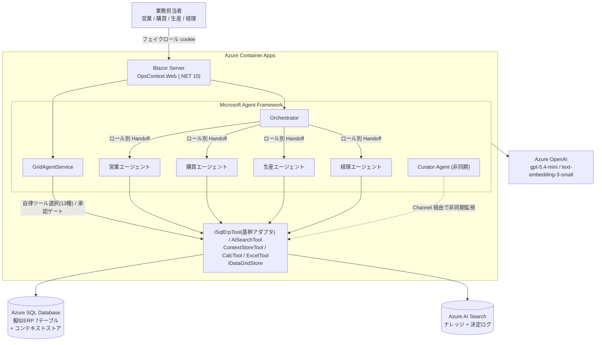
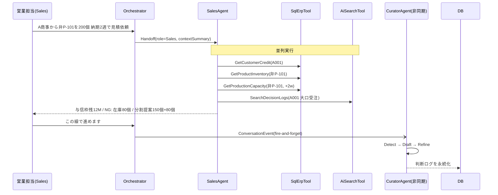
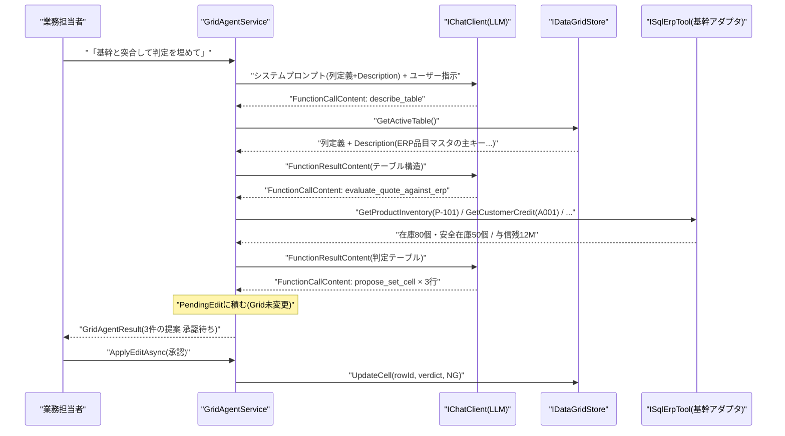
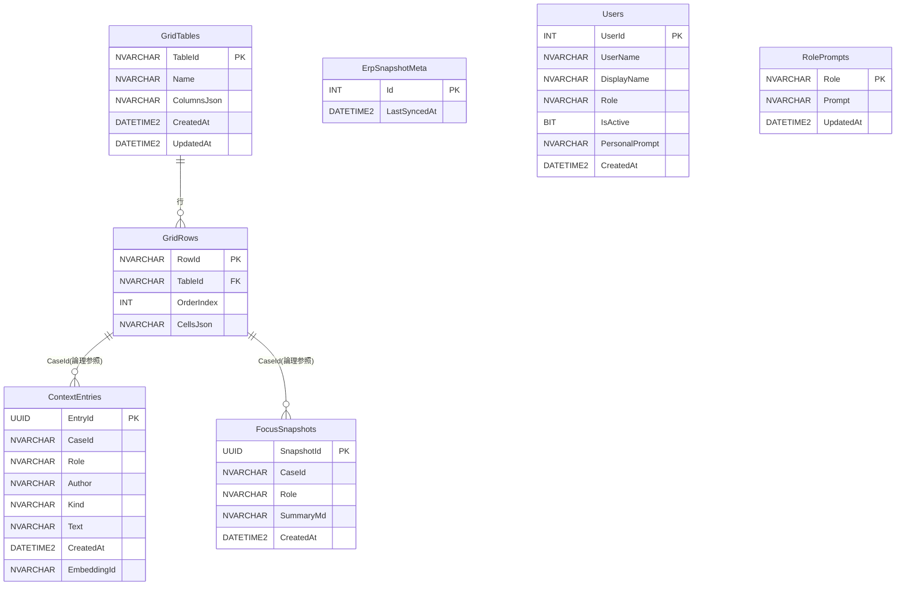

## ERPは"何が起きたか"を全部知っている。でも"なぜそう判断したか"は、3日後には誰も覚えていない

SIerとして10年近くERPに関わってきた。基幹システムの中には取引先の与信情報、在庫数、生産能力、過去の受注実績がすべて揃っている。データが足りないわけじゃない。

問題は、担当者が下した「判断」が一切記録されないことだ。ERPからデータを引き出して、Excelの上に判断を書き込んで、メールで回す。「この件は分割出荷で進める」「与信枠が怪しいので要確認」——そういう判断は、Excelのメモ欄か誰かの記憶の中にしか存在しない。3日後に別の担当者が同じ案件を触ったとき、その判断はもうどこにもない。毎週同じ問い合わせが来るのは、前回の判断理由が引き継がれないからだ。

これは「データが足りない」問題でも「引継ぎが下手」な問題でもない。ERPは事実（何が起きたか）を記録するシステムとして精緻に作られているが、判断（なぜそうしたか）を記録するシステムが存在しなかった問題だ。

その結果として起きることを具体的に書くと、A商事から大口受注が入った場面でこうなる。

- 営業は「与信枠に余裕があるか、今週中に納品できるか、粗利は確保できるか」を見て判断する
- 経理は「3か月前に支払い遅延があった、与信枠の80%がすでに消費されている、売上計上が月をまたぐ」を見て別の判断をする
- 生産は「2週間で120個まで対応可能だが、残り80個は翌週にずれ込む」を見てさらに別の判断をする

同じデータから、担当者ごとにまったく別の判断が生まれる。でもその判断はそれぞれ別のExcelの上に閉じ込められ、共有も蓄積もされない。「営業的にはOKだが経理的に懸念がある」という判断が、次の担当者に届かないまま揮発していく。

### なぜ「AIに聞く」では解けないのか

「ERP画面の横にチャットを置けばいい」と思うかもしれない。でもそれは「AIに聞く」であって「AIと一緒に仕事をする」ではない。

AIに質問して答えをもらっても、担当者は結局Excelを自分で直す。判断はまたExcelの中に閉じ込められ、根本の構造は変わらない。判断の揮発は「AIに聞く」では止まらない。AIへの質問は記録されても、その結果として下された判断は依然としてどこにも残らないからだ。

問題は3つの裂け目として構造化できる。

1つ目は、判断がロール間で翻訳されない問題だ。「経理から見た答え」は自然には出てこない。同じ案件データを経理視点で読み解いてくれる存在がいない。ロール別のシステムプロンプトを持つ専用エージェントが、その翻訳を自動化する。

2つ目は、判断が時間を超えて引き継がれない問題だ。「今回は分割提案で進める」という合意がどこかにメモされなければ、3日後に別の担当者が同じ質問をする。CuratorAgentが会話を裏で監視して判断ログに変換し続けることで、このループを断てる。

3つ目は、判断がデータに還流しない問題だ。見積明細のGridに対してAIと会話しながら、ERP突合・セル補完・判定記入・コンテキスト記録を一気通貫でやれる環境は今まで存在しなかった。GridAgentServiceがSQL照会を自律選択し、その結果と判断をその場で業務データに書き戻すことで、判断がERPデータの隣に残る。

この3つの裂け目を同時に埋めるために、マルチエージェント構成 + Grid × AI 協働編集という構成にした。


## デモ動画

https://www.youtube.com/watch?v=[VIDEO_ID]

## 作ったもの: OpsContext

OpsContextは、ERPが記録しない「判断」を、業務データの隣にリアルタイムで蓄積するプラットフォームだ。AIエージェントと人間が同じGridの上で協働し、その過程で下された判断はコンテキストとして自動的に積み上がる。次の担当者が同じ業務データを開いたとき、前任者の判断理由がそのロール視点に翻訳されて出てくる。

4本の機能軸を持つ。

1. **新規チャット** (`/chat`) — [翻訳] ロール別エージェントとの対話。営業・購買・生産・経理でシステムプロンプトが切り替わり、同じ質問でも語り口とフォーカスが変わる。
2. **業務データ** (`/data`) — [還流] テーブル一覧画面。新規テーブル作成やテーブル選択ができる。テーブルを開くと `/data/{TableId}` に遷移し、Grid編集とAI協働チャットが使える。列に「意味（Description）」を登録することで、AIがその列に対応する基幹照会を自律選択する。
3. **データセット** (`/dataset`) — 基幹ERPデータの読み取り専用ビュー。顧客・製品・在庫・生産能力・受注のマスタ・トランザクションをタブで閲覧できる。AIが参照する突合元データをそのまま見られる。
4. **コンテキスト管理** (`/context`) — [継承] 業務データごとに蓄積された決定・観察ログのタイムライン。コンテキストの記録単位は業務データ（GridテーブルのTableId）であり、同じ業務データを開いた担当者やロールが判断ログを共有できる。Curatorが自動生成したhandoffエントリは全ロールから横断参照できる。

データセット画面では、AIが突合に使う基幹マスタ（顧客の与信枠・残枠・格付けなど）をそのまま参照できる。


デモシナリオは1本に絞っている。「A商事から弁P-101を200個、納期2週間で見積依頼が来た」という1文から始まる大口受注の意思決定を、業務データGridでAIと突合しながら、Curatorがコンテキストを裏で積み上げていく流れを再現している。

## システム概要




| レイヤー | 技術 |
|---|---|
| Web フレームワーク | ASP.NET Core Blazor Server (.NET 10) |
| エージェント基盤 | Microsoft Agent Framework (Microsoft.Agents.AI v1.8.0) |
| LLM | Azure AI Foundry gpt-5.4-mini |
| Embedding | text-embedding-3-small |
| ベクトル検索 | Azure AI Search (ナレッジ / コンテキスト 2インデックス) |
| RDB | Azure SQL Database (Serverless, 無料オファー) |
| コンテナ実行基盤 | Azure Container Apps |
| デモ動画ナレーション | Azure AI Speech |

## エージェント設計

3つの裂け目（翻訳・継承・還流）を埋めるために、エージェントは6本 + GridAgentServiceで構成した。OrchestratorがHandoffの起点になり、ロール別の4エージェントが「翻訳」を担い、バックグラウンドのCuratorが「継承」を、GridAgentServiceが「還流」を担う。GridAgentServiceは業務データGrid専用の自律エージェントとして、LLMが13種のツールを自己選択し基幹を多段照会して変更提案を積む。

| エージェント/サービス | 役割 | 使用ツール |
|---|---|---|
| Orchestrator | ロールclaimを見てHandoff | ContextStoreTool（コンテキスト取得） |
| SalesAgent | 受注獲得・粗利・顧客リスク分析 | SqlErpTool × 3本 + AiSearchTool（並列） |
| AccountingAgent | 与信回収・売上計上・遅延歴警告 | SqlErpTool + AiSearchTool |
| PurchasingAgent | 仕入コスト・調達リスク評価 | SqlErpTool + AiSearchTool |
| ProductionAgent | 生産枠・部材手配・納期調整 | SqlErpTool + AiSearchTool |
| CuratorAgent | 会話から判断を自動抽出して蓄積（非同期） | ContextStoreTool |
| GridAgentService | Grid への自律AI協働編集・基幹多段照会・Human-in-the-loop | ISqlErpTool + IDataGridStore + AiSearchTool + QuoteValidationService + ContextStoreTool |
| IErpDatasetStore | 基幹データセットの読み取り専用ビュー提供（Dataset.razor 用） | ISqlErpTool（参照元） |

協調パターンは3種類使っている。

### Handoff: Orchestratorはルーティングだけしてロールエージェントに渡す



OrchestratorはReadCaseContextAsyncでコンテキスト取得だけ自分でやって、要約を添えてロールエージェントにHandoffする。複雑な判断はしない。ロールclaimで宛先を決めるルーターだ。

### Parallel: SalesAgentはSQL 3本 + AI Searchを同時実行する

SalesAgentの中核はこのコードだ。与信・在庫・生産能力の3本のSQLと、AI Searchの過去案件検索をTask.WhenAllで並列実行する。4本が揃ったところでLLMに営業視点の回答を生成させる。

```csharp
var creditTask    = _sqlErp.GetCustomerCreditAsync(customerCode, ct);
var inventoryTask = _sqlErp.GetProductInventoryAsync(productCode, ct);
var capacityTask  = _sqlErp.GetProductionCapacityAsync(productCode, today, twoWeeksLater, ct);
var searchTask    = _aiSearch.SearchDecisionLogsAsync(request.UserMessage, customerCode, topK: 5, ct);

await Task.WhenAll(creditTask, inventoryTask, capacityTask, searchTask);
```

「受注可否の判断・分割提案・推奨アクション」がこの1往復で出てくるのが審査員に見せるシーンだ。

### AI Search 2インデックス: ナレッジとコンテキストを分けた理由

Azure AI Searchのインデックスを2本に分けている。`opscontext-knowledge`（社内ナレッジ）と`opscontext-context`（案件判断ログ）だ。

`opscontext-knowledge`は「与信枠80%超過時は分割出荷を原則とする」「弁P-101の緊急対応枠は上長承認で最短2週間」のような、変わらない業務ルール・ポリシーを格納する。ロールフィルタ（`role eq 'Production'`）を持ち、生産・購買エージェントが自分のロールに関係するナレッジだけを絞り込んで取得できる。

`opscontext-context`は、CuratorAgentが会話から抽出してUpsertした判断ログが入る。顧客コードフィルタを持ち、「A商事の過去案件」だけを対象にベクトル検索できる。SalesAgentとAccountingAgentが過去の意思決定を参照するのはこのインデックスだ。

ロール別に検索先が分岐している:

| エージェント | 使うインデックス | フィルタ |
|---|---|---|
| ProductionAgent | opscontext-knowledge | roleFilter=Production |
| PurchasingAgent | opscontext-knowledge | roleFilter=Purchasing |
| GridAgentService | opscontext-knowledge | フィルタなし（全ロール） |
| SalesAgent | opscontext-context | customerCode |
| AccountingAgent | opscontext-context | customerCode |

書き込みは`ContextStoreTool.AppendDecision/AppendObservation`がSQL INSERTした後、best-effortで`UpsertContextEntryAsync`を呼んでベクトル化・インデックスに反映する。AI Searchへの書き込みが失敗してもSQLコミットは維持される。ナレッジ（静的）と判断ログ（動的）を検索対象として分離しながら、コンテキストが蓄積されるほど次の検索精度が上がる仕組みになっている。

### GridAgentService: LLMが自律ツール選択で基幹を多段照会する

GridAgentService（旧 GridChatService）は、旧設計の「LLM 1回呼び出し → 固定アクション JSON」から「自律ツール選択型」に進化した実装だ（コミット 29a00f6）。

生の `IChatClient` に `ChatOptions.Tools`（13種の `AIFunction`）を渡し、自前のツールループ（最大 10 反復）でLLMが自律的にツールを選んで多段実行する。`FunctionInvokingChatClient` でラップしない理由は2つある。(a) 実行過程を `IProgress<AgentActivity>` でUIにリアルタイム配信するため（「エージェントが考えている様子」を審査員に見せるトレーサビリティがここで出る）、(b) 書き込み系ツールを即時実行せず承認ゲートに積むためだ。

ツールは2系統に分かれている。

- 読み取り系（自動実行・8種）: `describe_table` / `read_rows` / `get_customer_credit` / `get_product_inventory` / `get_production_capacity` / `search_similar_orders` / `search_knowledge` / `evaluate_quote_against_erp`
- 提案系（提案のみ・5種）: `propose_set_cell` / `propose_add_row` / `propose_add_column` / `propose_delete_row` / `propose_delete_column`

提案系ツールはGridを直接変更しない。`PendingEdit` をクロージャに積むだけで、`ApplyEditAsync` が人間の承認を受けてはじめて `IDataGridStore` に反映する。Human-in-the-loopをコードレベルで強制している。

#### 業務データ列 ↔ 基幹マスタのマッピング

GridAgentServiceで鍵になるのが「列の Description（意味）がエージェントのツール選択判断の根拠になる」点だ。`describe_table` ツールが各列の Description を返し、LLMはその意味を読んでどの基幹照会が必要かを自分で判断する。

| 業務データ列 | Description（列の意味） | 照会される基幹ツール |
|---|---|---|
| `product_code`（品番） | ERP品目マスタの主キー | `get_product_inventory` / `get_production_capacity` |
| `unit_price`（単価） | ERP価格マスタの直近単価と突合 | `evaluate_quote_against_erp` |
| `customer_code`（顧客コード） | ERP得意先マスタの顧客コード | `get_customer_credit` |
| `verdict`（判定） | AIによるERP突合結果。OK/Warning/NGの3値 | 書き込み先（`propose_set_cell`） |

連携方式は物理的なデータ統合ではなく、「行のキー列を介したエージェントのツール照会」だ。`ISqlErpTool` は基幹アダプタとして設計されており、接続先の差し替えで実基幹に繋げられる構造になっている（将来はODBCアダプタやMCPサーバ化での実ERP接続を想定）。



AIが提案を積むとUI右パネルに「N件の編集提案があります」と表示され、担当者が1件ずつ（または一括で）承認・却下する。承認されて初めてGridに反映される。


数値判断は `QuoteValidationService`（`evaluate_quote_against_erp` の内部処理）が決定的に計算し、LLMは推奨文の生成のみを担う。「数値判断はコード、文章はLLM」の方針はGridAgentServiceでも継承している。

### Background: CuratorAgentが会話を裏で監視して判断を蓄積する

CuratorAgentはBackgroundServiceとして常駐し、Channelで受け取った会話イベントを非同期で処理する。ユーザーが「この線で進めます」と入力した瞬間、fire-and-forgetでCuratorにイベントを投げる。Blazorの応答速度に影響せず、裏で勝手に記録が積み上がっていく。

Grid上の操作も同じ仕組みでコンテキストに記録される。ERP突合を実行すると「Excel明細 N 行取込・うち M 行リスク」という observation が自動的にContextEntriesに追記され、同じ業務データをチャット画面で開いた担当者に引き継がれる。コンテキストの保存単位は業務データ（TableId）なので、「発注明細」と「在庫一覧」はそれぞれ独立した判断ログを持つ。

3ターンに1回、全エントリからロール別のFocusSnapshotも生成される。次の担当者がロールを切り替えて同じ業務データを開くと、「現在フォーカス / 懸案事項 / 次のアクション」がそのロール視点で再構成されて表示される。

## プロンプト設計

プロンプトはエージェントごとに完全に分けている。

### SalesAgentのシステムプロンプト

```
あなたは営業担当エージェントです。受注獲得・粗利確保・顧客との長期関係維持を最優先に分析してください。

## 役割と責務
- 与信枠の状況を踏まえた受注可否の判断
- 在庫・生産能力と納期の整合性チェック
- 分割受注・代替提案などの受注獲得シナリオの提示
- 過去類似案件を参照した判断根拠の明示

## 回答方針
- 数値は必ず明示する（曖昧にしない）
- リスクがある場合は「NG / Warning / OK」で判定してから説明する
- 推奨アクションを最後に箇条書きで示す

## 案件コンテキスト
{contextSummary}
```

「NG / Warning / OKで判定してから説明する」という出力形式を強制しているのがポイントだ。LLMを自由にさせると「与信に若干の懸念があります」のような曖昧な表現を返す。判定カテゴリを先に置くことで、審査員が見ても一目でわかる画面になった。

AccountingAgentはまったく別のシステムプロンプトを持ち、与信回収・遅延歴・売上計上の観点を前に押し出す。同じ基幹データを渡しても、どのロールが受け取るかで回答の切り口が変わる。それがOpsContextの根幹にある考え方だ。

### GridAgentServiceのシステムプロンプト

GridAgentServiceはシステムプロンプトに現在のテーブルの列定義（`Description` 含む）を埋め込み、LLMに行動規範を与える。LLMはアクションJSONを1回返すのではなく、ツールを自律選択して段階的に課題を解決するよう指示される。

```
# GRID_AGENT_MODE
あなたは業務データ Grid を扱う自律エージェントです。ツールを自分で選んで段階的に課題を解決します。

## 行動規範
- まず describe_table と read_rows でデータ構造・各列の意味・中身を理解してから動くこと。
- 列の意味(説明)を踏まえ、どの基幹照会(get_customer_credit / get_product_inventory /
  get_production_capacity / search_similar_orders / evaluate_quote_against_erp)が
  必要かを自分で判断して呼ぶこと。
- 数値判断は evaluate_quote_against_erp に任せ、その結果を根拠にすること。
- データ変更は必ず propose_* ツールで提案すること。あなたは Grid を直接変更できない。承認は人間が行う。
- 「更新しました」と断定せず、「〜を提案しました（承認待ち）」と述べること。
- 最終回答は日本語で、何を読み・何を根拠に・何を提案したかを簡潔にまとめること。

## 現在のテーブル「見積明細」の列
- key=product_code 表示名=品番 型=Text 意味=ERP品目マスタの主キー。英大文字+ハイフン+3桁数字の形式（例: P-101）。
- key=qty 表示名=数量 型=Number 意味=発注・見積の数量（通常は「個」）。
- key=unit_price 表示名=単価（円） 型=Number 意味=税抜き単価。ERP価格マスタの直近単価と突合する。
- key=verdict 表示名=判定 型=Text 意味=AIによるERP突合結果。OK / Warning / NG の3値。
...（実行時に全列を動的埋め込み）
```

`GRID_AGENT_MODE` マーカーをシステムプロンプトに埋め込み、MockChatClientではこのマーカーを検出してデモ用のツールループ応答を返す分岐を設けた。本番（Azure OpenAI）でも同一コードパスで動く。

`describe_table` が Description を返すことでLLMが列の意味を理解し、どの基幹照会が必要かを自律判断する。固定のアクション分類ではなく、列の説明から動的にツールを選ぶ仕組みだ。

### CuratorAgentのDetect→Draft→Refineの3段プロンプト

CuratorのDetectプロンプトが一番こだわった部分だ。

```
直近の会話ターンから暗黙の意思決定・判断・合意を検出してください。

検出ルール:
- "〜することにした" "〜で進める" "〜は却下" 等の表現を含む発言を対象とする。
- ユーザーが「この線で進めます」「承認します」「了解しました」と明示した場合は必ず検出する。

非検出:
- 単なる情報確認・質問・数値の整形のみのターンは検出しない。

出力形式: JSON 配列のみを出力すること。
[{"summary":"決定内容の要約","evidence":"根拠となった発言","status":"confirmed|tentative"}]
検出なしの場合は [] のみ出力する。
```

出力をJSON配列に強制するのは、後続のDraftプロンプトでパースできるようにするためだ。`[]` が返ってきたら判断なしと判定して処理を打ち切る。ここで止まらないと、雑談まで記録され始める。

DraftプロンプトはDecision / Context / Chosen / Why / Riskの5セクションを持つMarkdownテンプレートを出力形式として指定している。自作ツールCuriaのDecisionLogGeneratorServiceで使っていた構造をそのまま持ち込んだ。

Refineは単純な圧縮指示で、見出し構造だけ維持して400字以内に収める。

### FocusSnapshotのロール別要約プロンプト

3ターンに1回、全コンテキストエントリから各ロール視点の「現在フォーカス」を生成する。

```
あなたは案件コンテキストの要約担当です。
ユーザーが送信するエントリ一覧からロール {role} 視点の現在フォーカスを Markdown で出力してください。

出力ルール:
- 全文のみ出力。コードフェンス禁止。切り詰め禁止。
- 見出し構造（## 現在フォーカス / ## 懸案事項 / ## 次のアクション）を維持する。
- {role} ロールに関係する判断・引継ぎを優先してまとめる。
```

コードフェンス禁止・切り詰め禁止を明示しているのは、LLMが勝手に `...` で省略してFocusSnapshotが壊れるのを防ぐためだ。実際にハマって追加した制約だ。

## ビジネスインパクト

ERPが記録しない「判断」を業務データの隣に蓄積するとは、具体的にどういうことか。3つの裂け目をそれぞれ埋める。

### 判断がロール間で翻訳されない → 部門翻訳コストの解消

ERPデータへのアクセス権があっても、「自分のロール視点で読み解く能力」は担当者に依存する。OpsContextはロール別エージェントがこの翻訳を自動化し、新担当者が案件を引き継いでも「経理視点の懸念点」が即座に参照できる。

### 判断が時間を超えて引き継がれない → コンテキストの継承

「この線で進めます」という一文が、CuratorAgentによって「A商事案件: 分割出荷150個+80個で合意、与信枠確認済み」という判断ログに変換される。3日後に別の担当者がロールを切り替えて同じ業務データを開くと、その判断がロール視点に翻訳されて表示される。毎週同じ問い合わせが来るループが、初めて断てる。

### 判断がデータに還流しない → Excel引き回し文化への回答

Excel見積書をアップロードしてGrid表示 → AIに「基幹と突合して」と指示 → GridAgentServiceが品番列からERP在庫・与信・生産枠を自律照会し、判定/リスク/推奨アクションをセルへの提案として積む → 担当者が承認するとGridに反映される。この結果を「この線で進めます」でコンテキストに記録すると、同じ業務データを次に開いた担当者には「Excel明細 N 行取込・うち M 行リスク」という観察ログが引き継がれている。コンテキストは業務データ単位で蓄積されるため、「発注明細の突合結果」は「在庫一覧の判断」と混ざらない。ExcelとERPとコンテキストが初めてつながる。

### SIerとしての展望

導入コストの観点では、SQLスキーマをGRANDITの実テーブルにマッピングする作業と、接続情報のDI差し替えが主な追加作業になる。エージェントのシステムプロンプトと判断ロジック（CalcTool）はERP固有の業務知識を盛り込んでいるため、そのまま流用できる部分が多い。

## 技術詳細

### データモデル



物理テーブルは `GridTables` / `GridRows` の2本に統一している。ERP基幹データ（顧客・製品・在庫・生産能力・受注・与信履歴）は `TableId` が `erp_` で始まる論理テーブルとして `GridRows` に格納され、セル値は `CellsJson`（`Dictionary<string,string?>` のJSON）として保持する。実際のERP連携では API/ODBC 経由の定期同期でこの `erp_` 行群を上書きする設計で、`ErpSnapshotMeta` が最終同期日時を記録する。業務データ（担当者が作成する見積明細等）は `erp_` 以外の `TableId` を持つ行として同じ `GridRows` に共存する。`ContextEntries` と `FocusSnapshots` の `CaseId` は `GridRows.RowId` を文字列参照する論理結合で、FK制約は持たない。`Users` と `RolePrompts` はアプリ管理テーブルとして独立している。

### Microsoft Agent Framework — 使ったもの・使わなかったものを正直に書く

「Microsoft Agent Framework を使い倒す」と言いながら、実装をコードで見ると `Microsoft.Extensions.AI` の `IChatClient` 抽象ベースが中心で、Agent Framework の高レベル API はほぼ使っていない。ここは正直に書く。

参照している NuGet パッケージは `Microsoft.Agents.AI` と `Microsoft.Agents.AI.OpenAI`（v1.8.0）だ。ただし実際のエージェント実装では、フレームワークが提供する `AIAgent` / `AgentThread` / `WorkflowGraph` といった高レベル API ではなく、`IChatClient`（`Microsoft.Extensions.AI` の標準インターフェース）を直接呼んでいる。Handoff・並列実行・Curator のバックグラウンド処理も C# で手書きした。

なぜそうしたかの理由は2つある。

第一に、プレビュー段階のフレームワークで API の互換性が保証されないなか、ハッカソンの2日間で確実に動かすには「自分が制御できる層に寄せる」判断が合理的だった。実際にパッケージ構成が途中で変わっており、バージョン追いかけだけで数時間を失うリスクがあった。

第二に、ERP 業務ロジックをフレームワークのブラックボックスに入れたくなかった。QuoteValidationService が「数値判断は CalcTool、文章は LLM」という分離を徹底しているのと同じ思想で、エージェントの協調ロジックも自分で書いた方が与信計算・在庫判定の制御が明確になる。

Agent Framework から実際に得た恩恵は3点ある。`IChatClient` の標準抽象（Mock / Azure OpenAI の差替えを DI 1 行で切替可能）、`ChatMessage` / `ChatRole` 等の標準型によるコードの一貫性、そして Agent Framework が前提とする設計思想（エージェント単位での責務分割・Tool 層の分離）だ。

WorkflowGraph や MCP サーバー連携といった Agent Framework 固有の高レベル機能は今回のスコープでは採用しなかった。ERP 接続の安定動作を優先した結果の選択だが、「使い倒し感」という観点での弱点であることは認識している。MCP 連携については、既存の ERP システムを MCP サーバーとして公開することで接続構成をシンプルにできる将来の拡張として考えている。

### CuratorをBackgroundServiceにするとScopedサービスが使えない問題

CuratorHostedServiceはSingleton登録のBackgroundServiceだが、IContextStoreTool（ContextStoreTool）はScopedサービスだ。直接DI注入するとScopeの不一致で例外が出る。IServiceScopeFactoryを使って処理ごとにスコープを生成して解決した。

```csharp
await using var scope = scopeFactory.CreateAsyncScope();
var contextStore = scope.ServiceProvider.GetRequiredService<IContextStoreTool>();
await ProcessAsync(ev, contextStore, ct);
```

EF Coreのような典型的なScopedサービスを非同期バックグラウンドサービスで使うとき、同じ問題に当たる。

### GridAgentServiceを「自律ツール選択型」にした理由

当初の GridChatService は「LLM 1回呼び出し → 固定アクション JSON」方式だった。この方法だと数値判断（在庫が足りるか、与信を超えるか）もLLMに委ねることになり、ハルシネーションリスクが高い。また、どの基幹照会が必要かの判断を呼び出し側が事前に決めなければならず、汎用性が低かった。

GridAgentServiceで徹底した分離は2点ある。「LLMはツールの選択と推奨文の生成だけを行い、数値判断はCalcTool/QuoteValidationServiceが行う」こと。そして「書き込み系ツールは提案のみで、適用は人間承認時のみ（Human-in-the-loop）」にすることだ。

これにより、列の Description を読んだLLMが「この品番列はERP品目マスタのキーだ → `get_product_inventory` を呼ぼう」と自律判断する流れが成立する。固定スクリプトではなく、テーブル定義が変わっても Description さえ書いておけばエージェントが適切な基幹照会を選ぶ。

### 擬似ERP環境の作り込みレベルの判断

SQLスキーマはERPの実テーブル構造をそのまま持ち込んでいない。取引先マスタ・製品マスタ・在庫・生産能力・売掛残高・与信限度・支払い遅延歴の7テーブルをデモシナリオに必要な最小限で設計している。

ERP経験がないと「このシナリオで何のテーブルが必要か」の判断がつかない。seed.sqlに仕込んだ「A商事の3か月前の支払い遅延」という一行が、経理エージェントの回答を完全に変える。このリアリティがERP経験者が作る価値だと思っている。

:::message
擬似ERP環境での動作であり、実際のGRANDIT等のERPパッケージとの接続は含んでいない。本番ERP連携にはSQLスキーマのマッピング作業が別途必要になる。
:::

## 今後の展望

デモシナリオは「大口受注の意思決定」1本に絞り、ロール別翻訳・Grid × AI 協働・コンテキスト継承のコンセプト実証に特化している。

実業務への適用を考えると次のステップが想定される。

- SQLスキーマをGRANDITの実テーブルにマッピング（ISqlErpToolの接続先差し替えが主な作業）
- 見積明細へ顧客コード列（customer_code）を追加し、行ごとにERP得意先マスタへ直接紐付ける（現在はevaluate_quote_against_erpでA001に固定）
- MCPサーバ化による実基幹接続（ISqlErpToolをMCPサーバ経由のアダプタに差し替え）
- Entra ID App Roles による本物の認証（現状はフェイクハンドラ）
- Grid定義のユーザーカスタマイズ（複数テーブル管理）

## 完成度・実現性について

デモは審査期間（2026/6/2〜6/18）を通じてAzure Container Apps上で稼働状態を維持する。

- モックモード（`--mock` フラグ）を実装してあり、Azure接続なしでもUIとエージェントの動作を確認できる
- フェイクロール認証で審査員が認証情報なしにロール切り替えを試せる
- Dockerfileをリポジトリルートに置いており、`az containerapp up --source .` 1コマンドでデプロイできる構成にしてある

運用性という観点では、Curatorのバックグラウンドサービスはエラーをcatchしてログに落とすだけで本線のチャット応答には影響しない設計にしてある。GridAgentServiceも同様で、ERP突合が失敗してもチャット応答は返る。コンテキスト蓄積やGrid更新が止まっても本線が落ちないようにしている。

## おわりに

Microsoft Agent Hackathon 2026 には「ERPのAI化という課題に、自分の業務知識を直接ぶつける機会」として参加した。

ERPは「事実のシステム・オブ・レコード」として長年機能してきた。何が起きたかは全部記録される。でも「なぜそう判断したか」のシステム・オブ・レコードはなかった。OpsContextはそこを埋めようとする試みだ。

今回の提出物の核は、ERP経験から直接生まれた設計判断にある。seed.sqlに仕込んだ「A商事の3か月前の支払い遅延」という一行が経理エージェントの回答を変える——このリアリティは、ERPを10年扱ってきた経験がなければ出てこない。テーブル構造、プロンプトの業務ロジック、デモシナリオの解像度はすべてそこから来ている。Microsoft Agent FrameworkとAzureのスタックを使い切ることで、パートナーベンダー部門の「使い倒し感」の評価軸にも応えるよう設計した。

リポジトリ: https://github.com/yt3trees/OpsContext（準備中）

---

## 記事公開チェックリスト

- [ ] タイトルにキーワードが入っているか（ERP / Azure / エージェント / Microsoft Agent Framework / Grid）
- [ ] デモ動画が記事の上部に埋め込まれているか（[VIDEO_ID] を差し替える）
- [ ] 画像ファイルを /images/ に配置したか (_asset/product_concept.png → /images/product_concept.png, _asset/azure-architecture.drawio.png → /images/azure-architecture.png)
- [ ] プロンプト設計のセクションが GridAgentService（GRID_AGENT_MODE）ベースになっているか
- [ ] 非ERP読者でも課題感が伝わる書き方になっているか
- [ ] Grid × AI 協働の説明が技術的に正確か（自律ツール選択・13種・Human-in-the-loop を含むか）
- [ ] 業務データ列 ↔ 基幹マスタのマッピング表が掲載されているか
- [ ] エージェント表・アーキ図の GridAgentService、gpt-5.4-mini が正しいか
- [ ] 冒頭フックが"判断の揮発"主軸になっているか（ERPは事実を記録するが判断は記録しない、が記事全体に通っているか）
- [ ] 公開設定が「全体公開」になっているか（published: true に変更）
- [ ] Zennハッカソンページからの提出を完了したか
